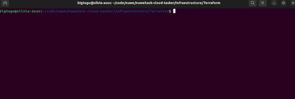
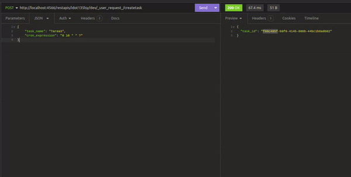
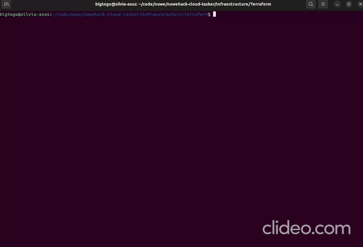

# TaskAPI

TaskAPI is a system for managing tasks and scheduled tasks through an API interface. This README provides an overview of the project structure, its objectives, and how to set it up for development and deployment.

## Table of Contents

- [Project Description](#project-description)
- [Project Structure](#project-structure)
- [Environment Setup](#environment-setup)
- [Usage](#usage)
- [Objectives](#objectives)

## Project Description

The main objective of TaskAPI is to create a system for storing tasks and executing scheduled tasks using AWS Lambda functions, DynamoDB, S3, and AWS API Gateway. The system includes the following components:

- **Endpoints**: TaskAPI provides two endpoints:

  - `/createtask`: This endpoint inserts a task into DynamoDB. It expects a JSON payload with `task_name` and `cron_expression` fields via a POST request.
  - `/listtask`: This endpoint retrieves tasks stored in DynamoDB and returns them as a JSON response via a GET request.

- **Scheduled Task Execution**: A third Lambda function, `executeScheduledTask`, is triggered every minute using EventBridge. Its purpose is to create an item in an S3 bucket named `taskstorage`.
  The function accomplishes this task by generating a unique object key using UUID, then creates a new object with a predefined content "Hello, this is a new object created by executeScheduledTask lambda."
  in the specified S3 bucket. If successful, it returns a response with a status code of 200 and a message indicating successful object creation in S3. If an error occurs during the process, it returns a response with a status code of 500 and an error message indicating failure to create the object in S3.

<p align="center">
  
</p>

## Project Structure

The project follows a predefined structure to ensure correct functionality and automated testing. Here's an overview:

```
nuwehack-terraform-tasker/
├── Infraestructure
│   ├── lambda
│   │   ├── create_task.py
│   │   ├── list_task.py
│   │   ├── task_storage.py
│   │   └── README.md
│   └── Terraform
│       ├── main.tf
│       └── policy.json
├── README.md
└── requirements.txt
```

- `Infraestructure`: Contains Terraform configuration for deploying AWS resources.
  - `lambda`: Contains Python scripts for Lambda functions.
  - `Terraform`: Contains the main Terraform configuration file `main.tf` and a policy file `policy.json`.
- `README.md`: This file, providing project documentation.
- `requirements.txt`: File specifying Python dependencies.

## Environment Setup

To set up the development environment and deploy the project, follow these steps:

1. **Install Localstack**: Localstack is used for local development. Make sure it's installed and running.
2. **Configure AWS Provider**: Update `main.tf` with appropriate AWS provider configuration.
3. **Install Dependencies**: Install Python dependencies listed in `requirements.txt`.
4. **Deploy Infrastructure**: Use Terraform to deploy the infrastructure defined in `main.tf`.

## Usage

Once the infrastructure is deployed, you can interact with TaskAPI using the provided endpoints:

- `/createtask`: Send a POST request with JSON payload containing `task_name` and `cron_expression`, which will also save this information in a DynamoDB table named TaskTable.
- `/listtask`: Send a GET request to retrieve a list of tasks stored in DynamoDB inside TaskTable.

The scheduled task execution is automated and does not require manual interaction.

<p align="center">
  
</p>

## Objectives

The project objectives include:

1. Ensure `main.tf` file is functional and ready for deployment.
2. Deploy all proposed resources defined in the Terraform configuration.
3. Make API and Lambda functions fully functional.
4. Implement EventBridge and the third Lambda function for scheduled task execution.

Ensure adherence to the provided guidelines and naming conventions for successful automated testing of the infrastructure.

<p align="center">
  
</p>

##

This README serves as a guide for understanding and setting up the TaskAPI project. For further details on specific components or functionalities, refer to individual files and documentation within the project directory.
